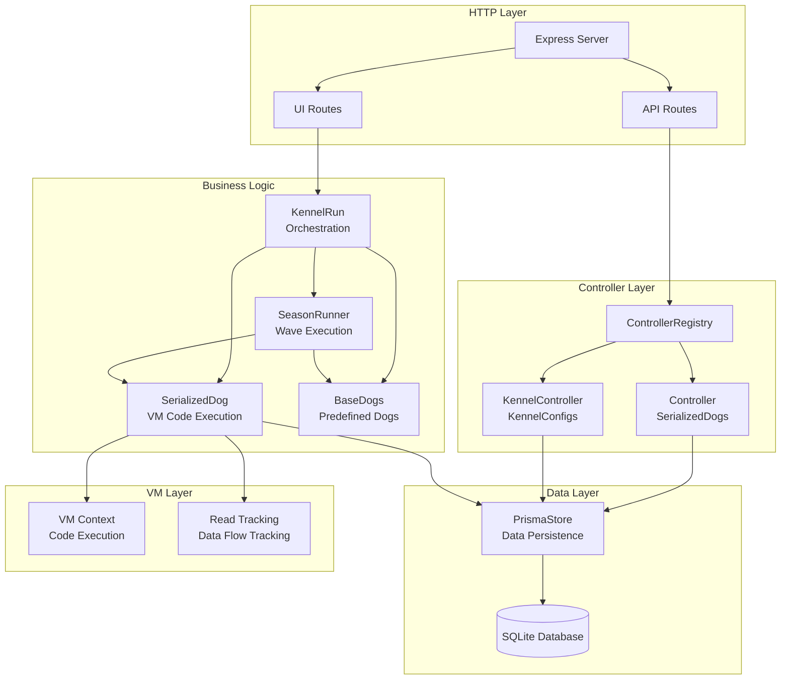
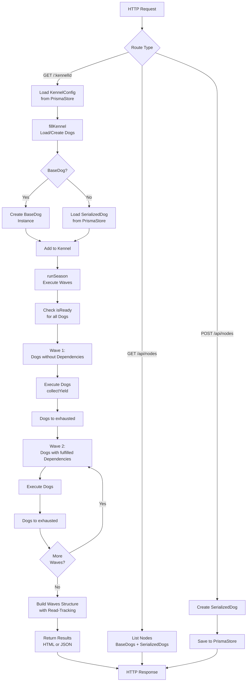
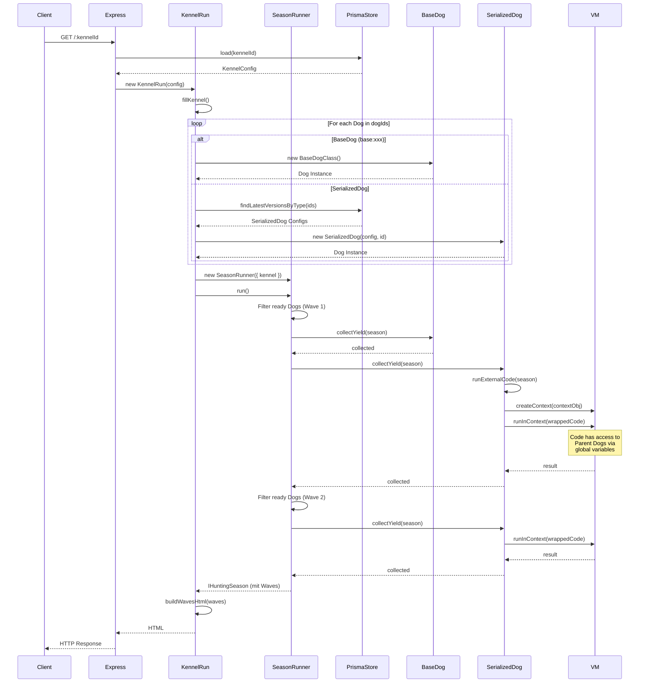
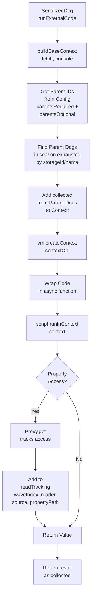
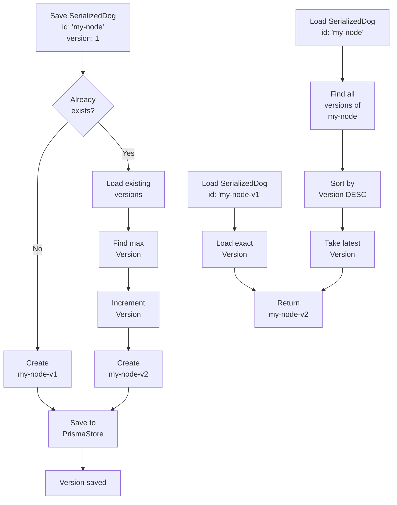

# Architecture Documentation

This documentation describes the architecture of the Data Hunt application, its components, data flows, and execution processes.

## System Overview

The Data Hunt application is an Express.js-based application that organizes data processing units ("Dogs") in configurations ("Kennels") and executes them in dependency order.

## Komponenten-Architektur



## Datenfluss-Architektur

### Request-zu-Response Datenfluss



### Datenfluss zwischen Dogs

```mermaid
flowchart LR
    subgraph "Wave 1"
        Dog1[RandomRecipesRetriever<br/>collected: recipes[]]
    end
    
    subgraph "Wave 2"
        Dog2[SerializedDog<br/>theRun: Code]
        Dog3[SerializedDog<br/>theRun: Code]
    end
    
    subgraph "VM Context"
        Context[VM Context<br/>fetch, console<br/>+ Parent Dogs]
    end
    
    subgraph "Read Tracking"
        Tracking[Read Tracking<br/>Property Accesses]
    end
    
    Dog1 -->|collected| Context
    Context -->|globale Variable| Dog2
    Context -->|globale Variable| Dog3
    Dog2 -->|Property-Zugriff| Tracking
    Dog3 -->|Property-Zugriff| Tracking
    Dog2 -->|collected| Results[Results]
    Dog3 -->|collected| Results
```

## Run Process

### Sequence Diagram of a Complete Run



## Dependency Resolution

### How Dependencies are Resolved

```mermaid
flowchart TD
    Start[Kennel with Dogs] --> InitSeason[Initialize Season<br/>exhausted: []<br/>withBeesInThePants: all Dogs]
    
    InitSeason --> CheckReady[Check isReady<br/>for all Dogs]
    
    CheckReady --> CheckRequired{Required<br/>Parents<br/>fulfilled?}
    CheckRequired -->|No| NotReady[Dog not ready<br/>stays in<br/>withBeesInThePants]
    CheckRequired -->|Yes| CheckOptional{Optional<br/>Parents<br/>fulfilled?}
    
    CheckOptional -->|Still in<br/>withBeesInThePants| NotReady
    CheckOptional -->|All in<br/>exhausted| Ready[Dog is ready<br/>can run in Wave]
    
    Ready --> AddToWave[Add to<br/>current Wave]
    AddToWave --> ExecuteDog[Execute Dog<br/>collectYield]
    
    ExecuteDog --> MoveToExhausted[Add Dog to<br/>exhausted]
    MoveToExhausted --> RemoveFromBees[Remove Dog from<br/>withBeesInThePants]
    
    RemoveFromBees --> MoreDogs{More<br/>ready Dogs?}
    MoreDogs -->|Yes| CheckReady
    MoreDogs -->|No| NextWave{Next<br/>Wave?}
    
    NextWave -->|Yes| CheckReady
    NextWave -->|No| Done[All Dogs<br/>executed]
    
    NotReady --> MoreDogs
```

### Dependency Matching for SerializedDogs

```mermaid
flowchart LR
    Start[SerializedDog<br/>parentsRequired:<br/>['node-v1', 'base:QueryRetriever']] --> MatchParent{Parent<br/>found?}
    
    MatchParent -->|SerializedDog| CheckStorageId[Check storageId<br/>node-v1 === storageId?]
    MatchParent -->|BaseDog| CheckName[Check name<br/>QueryRetriever === name?]
    
    CheckStorageId -->|Yes| Found[Parent found<br/>in exhausted]
    CheckStorageId -->|No| NotFound[Parent not<br/>found]
    
    CheckName -->|Yes| Found
    CheckName -->|No| NotFound
    
    Found --> AddToContext[Add collected<br/>to VM-Context<br/>as global variable]
    AddToContext --> Ready[Parent available<br/>in code]
    
    NotFound --> Wait[Wait for<br/>Parent]
```

## VM Context and Read Tracking

### How the VM Context is Created



### Read Tracking Details

```mermaid
flowchart LR
    subgraph "Season"
        Exhausted[exhausted:<br/>Array of Dogs]
    end
    
    subgraph "Proxy Layer"
        ProxyExhausted[Proxy around<br/>exhausted Array]
        ProxyDog[Proxy around<br/>each Dog]
        ProxyCollected[Proxy around<br/>collected Object]
    end
    
    subgraph "Code Execution"
        Code[SerializedDog Code<br/>const data = exhausted[0].collected.value]
    end
    
    subgraph "Tracking"
        ReadTracking[readTracking Array<br/>waveIndex: 1<br/>readerInstance: Dog2<br/>sourceInstance: Dog1<br/>propertyPath: 'value']
    end
    
    Exhausted --> ProxyExhausted
    ProxyExhausted --> ProxyDog
    ProxyDog -->|collected access| ProxyCollected
    ProxyCollected -->|Property access| Code
    Code -->|get 'value'| ProxyCollected
    ProxyCollected -->|track| ReadTracking
```

## Version Management

### How Versions are Managed



## Data Structures

### IHuntingSeason

```typescript
interface IHuntingSeason {
    withBeesInThePants: IHuntingDog<unknown>[];  // Dogs that still need to run
    exhausted: IHuntingDog<unknown>[];          // Dogs that are finished
    runIndex: number;                           // Current run index
    maxRuns: number;                            // Maximum number of runs
    wave: Array<IWaveEntry[]>;                 // Array of waves
    readTracking: IReadTrackingEntry[];         // Tracking of property accesses
    currentWaveIndex?: number;                  // Current wave index
}
```

### IKennelConfig

```typescript
interface IKennelConfig {
    id: string;
    name?: string;
    description?: string;
    dogIds: string[];                           // Array of dog IDs
    defaultQuery?: Record<string, string>;      // Default query parameters
    defaultBody?: any;                          // Default body data
    createdAt?: Date;
    updatedAt?: Date;
}
```

### ISerializedDogConfig

```typescript
interface ISerializedDogConfig {
    id: string;
    theRun: string;                             // TypeScript code as string
    version: number;                            // Version number
    parentsRequired?: string[];                 // Required parent IDs
    parentsOptional?: string[];                 // Optional parent IDs
}
```

## Important Files

- **[main.ts](main.ts)**: Entry point, Express server setup, route handlers
- **[KennelRun.ts](KennelRun.ts)**: Run orchestration, fillKennel, runSeason
- **[harverster.ts](harverster.ts)**: SeasonRunner for wave execution
- **[dogs/SerializedDog.ts](dogs/SerializedDog.ts)**: VM code execution, context creation
- **[store/PrismaStore.ts](store/PrismaStore.ts)**: Data persistence, version management
- **[core/enities/abstractHuntingDog.ts](core/enities/abstractHuntingDog.ts)**: Base dog logic, dependency resolution, read tracking

