# Architecture — tongues of the void

This is not a manual that pretends the machine is innocent. It is a map of the hunt — how **Dogs** are bred, chained in **Kennels**, and sent out in **Waves** until something answers. The UI whispers **Requiem** lines while it loads (see [`ui-app/src/app/data/requiem-loading.ts`](ui-app/src/app/data/requiem-loading.ts)): nine names, nine keywords, eighteen lines borrowed from the Void tongue. Below, those same voices thread through the stack — not as decoration, but as **names for forces** that already live here: absence, flame, unwritten law, stubborn order, accusing light, roiling chaos, decaying memory, closed time, and the branch that has not yet chosen its shape.

---

> *From brooding gulfs are we beheld*  
> *By that which bears no name.*  
> — **Lohk** · *Void*

## System Overview — the gulf and the nameless gate

**Lohk** names the hollow between you and the world: the browser gulf, the server gulf, the gulf where external APIs hang like unnamed stars. The application is Express: it gathers **Dogs** into **Kennels** and runs them in dependency order — nothing more sacred, nothing less mechanical. What crosses that void is HTTP; what returns is **collected** flesh: JSON, HTML, or silence.

### System context

Who speaks to whom — the operator, the lodge of Angular, the Express gate, the stone that remembers (`PrismaStore`), and the distant endpoints that bleed data when the pack asks.

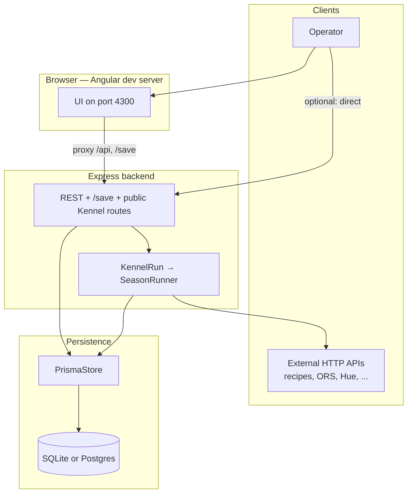

### Lead dog — whose catch becomes the answer

Covenant is **order in `dogIds`**: the **first** slot is the **lead**. The graph still commands the waves; the lead alone decides **whose yield** becomes the public face of the hunt — the body returned to `GET /:kennelId` and kin. Wave logic does not bow to the lead; the response does.

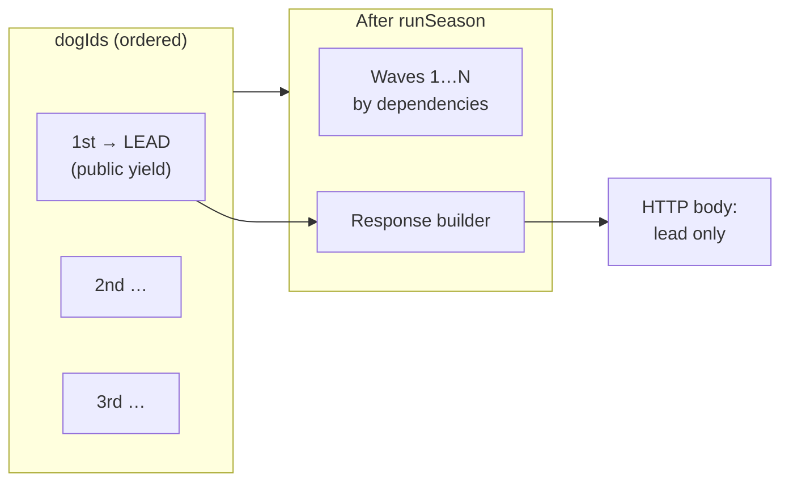

---

> *Its heralds are the stars it fells*  
> *The sky and Earth aflame.*  
> — **Xata** · *Truth*

## HTTP surface — heralds and naked flame

**Xata** is the truth that does not negotiate: routes are what they are. `ConfigRouteHandler` mounts CRUD under `/api`; `KennelRunHandler` adds **run**, **execute**, Swagger, and the bare **`/:kennelId`** hunt. The herald is the request; the fallen star is the response. No pleasant lie — only status codes and bodies.

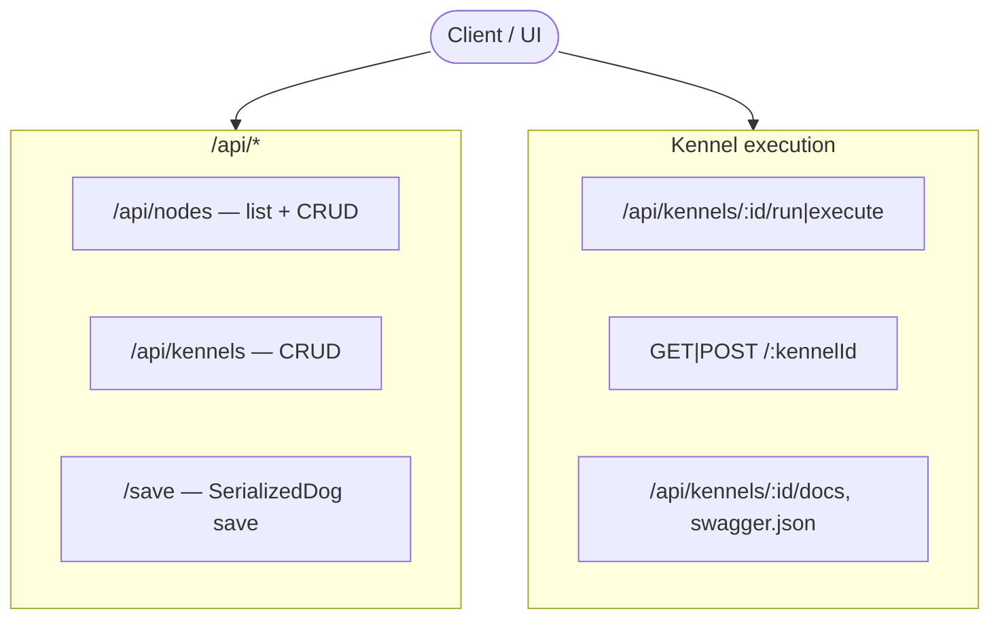

---

> *Corporeal laws are unwrite*  
> *As suns and love retreat.*  
> — **Jahu** · *Form*

## Komponenten-Architektur — flesh made diagram

**Jahu** speaks of **form**: layers stack whether you believe in them or not — HTTP, controllers, orchestration, VM, persistence. The diagram below is the unwritten law made visible: Express above, Prisma below, **SerializedDog** in the crucible next to **BaseDogs**. Form does not ask permission.

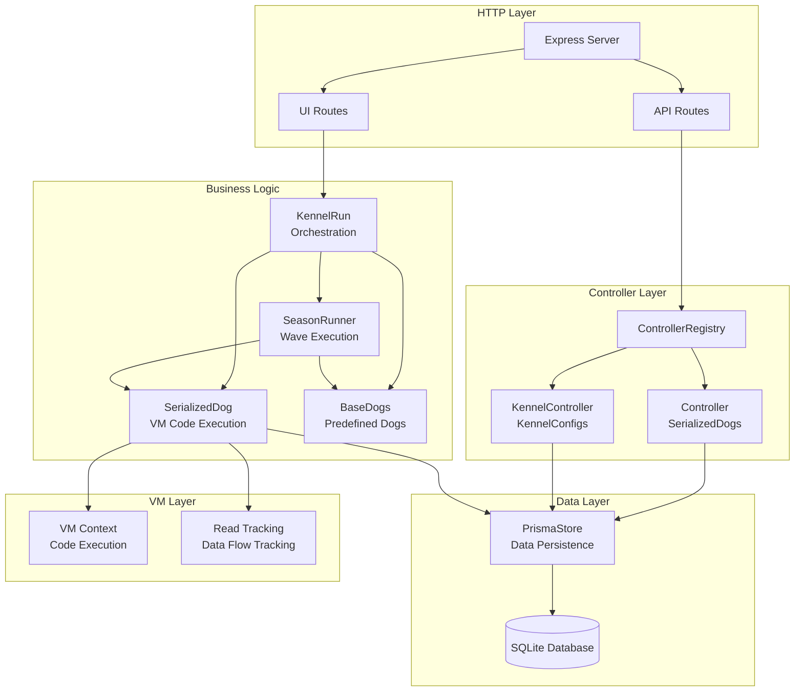

---

## Datenfluss-Architektur — rivers without mercy

### Request-zu-Response Datenfluss

A request enters; the route kindles one path. The Kennel loads; **fillKennel** names the beasts; **runSeason** walks the waves until **exhausted** holds every throat that will speak. Then read-tracking weaves memory into the structure you return — **Xata** again: what happened, tabulated.

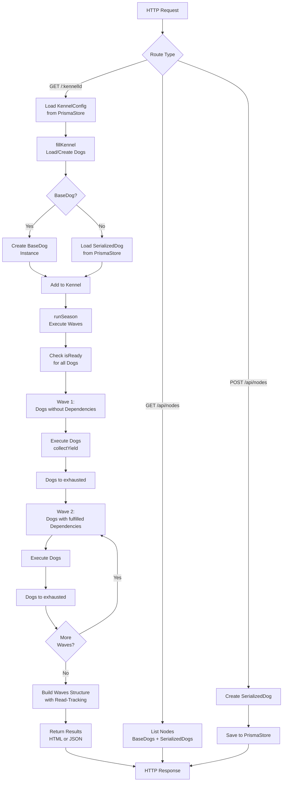

### Datenfluss zwischen Dogs

Parents bleed **collected** into the VM’s sky; children drink from globals. The wave order is not love — it is **fulfilled dependency**, which is a colder contract.

```mermaid
flowchart LR
    subgraph "Wave 1"
        Dog1[RandomRecipesRetriever<br/>collected: recipes[]]
    end
    
    subgraph "Wave 2"
        Dog2[SerializedDog<br/>theRun: Code]
        Dog3[SerializedDog<br/>theRun: Code]
    end
    
    subgraph "VM Context"
        Context[VM Context<br/>fetch, console<br/>+ Parent Dogs]
    end
    
    subgraph "Read Tracking"
        Tracking[Read Tracking<br/>Property Accesses]
    end
    
    Dog1 -->|collected| Context
    Context -->|globale Variable| Dog2
    Context -->|globale Variable| Dog3
    Dog2 -->|Property-Zugriff| Tracking
    Dog3 -->|Property-Zugriff| Tracking
    Dog2 -->|collected| Results[Results]
    Dog3 -->|collected| Results
```

---

> *To cosmic madness laws submit*  
> *Though stalwart minds entreat.*  
> — **Vome** · *Order*

## Run Process — the season submits

**Vome** is **order inside madness**: `SeasonRunner` does not care for your entreaties — only for **isReady**, **exhausted**, and the wave index. Below, the sequence is the liturgy: Client begs Express; **KennelRun** fills the kennel; **SerializedDog** opens the VM; the season returns, and HTML or JSON is the amen.

### Sequence Diagram of a Complete Run

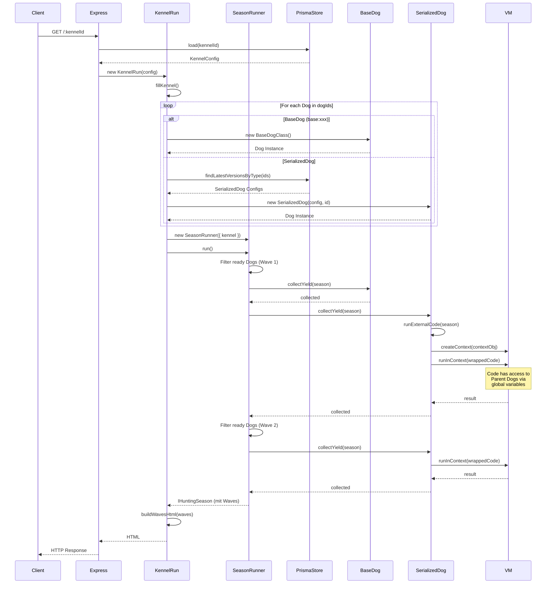

---

## Dependency Resolution — who waits, who runs

### How Dependencies are Resolved

**withBeesInThePants** holds the restless; **exhausted** holds the done. Required parents must rest before you run; optional parents may linger in shadow. This is **Vome** again — graph truth, not mercy.

```mermaid
flowchart TD
    Start[Kennel with Dogs] --> InitSeason[Initialize Season<br/>exhausted: []<br/>withBeesInThePants: all Dogs]
    
    InitSeason --> CheckReady[Check isReady<br/>for all Dogs]
    
    CheckReady --> CheckRequired{Required<br/>Parents<br/>fulfilled?}
    CheckRequired -->|No| NotReady[Dog not ready<br/>stays in<br/>withBeesInThePants]
    CheckRequired -->|Yes| CheckOptional{Optional<br/>Parents<br/>fulfilled?}
    
    CheckOptional -->|Still in<br/>withBeesInThePants| NotReady
    CheckOptional -->|All in<br/>exhausted| Ready[Dog is ready<br/>can run in Wave]
    
    Ready --> AddToWave[Add to<br/>current Wave]
    AddToWave --> ExecuteDog[Execute Dog<br/>collectYield]
    
    ExecuteDog --> MoveToExhausted[Add Dog to<br/>exhausted]
    MoveToExhausted --> RemoveFromBees[Remove Dog from<br/>withBeesInThePants]
    
    RemoveFromBees --> MoreDogs{More<br/>ready Dogs?}
    MoreDogs -->|Yes| CheckReady
    MoreDogs -->|No| NextWave{Next<br/>Wave?}
    
    NextWave -->|Yes| CheckReady
    NextWave -->|No| Done[All Dogs<br/>executed]
    
    NotReady --> MoreDogs
```

### Dependency Matching for SerializedDogs

Storage IDs and **base:** names are the two dialects of parentage. Match wrong, and the child waits in the dark.

```mermaid
flowchart LR
    Start[SerializedDog<br/>parentsRequired:<br/>['node-v1', 'base:QueryRetriever']] --> MatchParent{Parent<br/>found?}
    
    MatchParent -->|SerializedDog| CheckStorageId[Check storageId<br/>node-v1 === storageId?]
    MatchParent -->|BaseDog| CheckName[Check name<br/>QueryRetriever === name?]
    
    CheckStorageId -->|Yes| Found[Parent found<br/>in exhausted]
    CheckStorageId -->|No| NotFound[Parent not<br/>found]
    
    CheckName -->|Yes| Found
    CheckName -->|No| NotFound
    
    Found --> AddToContext[Add collected<br/>to VM-Context<br/>as global variable]
    AddToContext --> Ready[Parent available<br/>in code]
    
    NotFound --> Wait[Wait for<br/>Parent]
```

---

> *Through endless faces, countless forms,*  
> *a multitude unfolds.*  
> — **Oull** · *Possibility*

## Pacts, Mimics, and Auto-Mimic — shapes not yet born

**Oull** is **possibility**: a **Pact** is only a shape (`__isPact: true`), not a runner. A **MimicDog** wears that shape until truth arrives. **`autoMimic`** conjures when nothing fulfills the Pact; it **unmakes** the Mimic when a real Dog steps into the kennel. Endless faces — one graph, many outcomes.

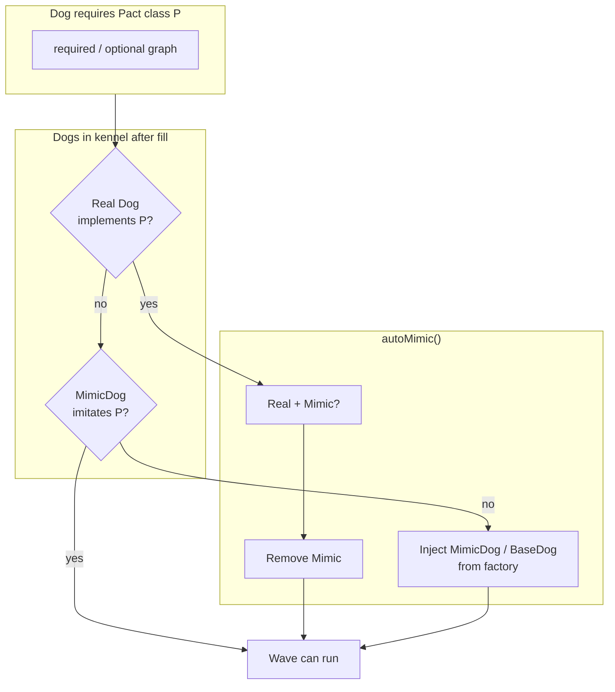

---

> *In luminous space blackened stars*  
> *They gaze, accuse, deny.*  
> — **Ris** · *Light*

## VM Context and Read Tracking — the accuser’s ledger

**Ris** names the **light that judges**: every property read can be witnessed. Proxies wrap **exhausted**, **collected**, the path of the getter — **readTracking** remembers **who** read **what** from **whom** in **which wave**. Deny if you wish; the ledger does not blink.

### How the VM Context is Created

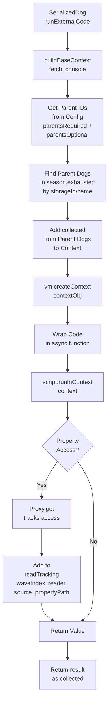

### Read Tracking Details

```mermaid
flowchart LR
    subgraph "Season"
        Exhausted[exhausted:<br/>Array of Dogs]
    end
    
    subgraph "Proxy Layer"
        ProxyExhausted[Proxy around<br/>exhausted Array]
        ProxyDog[Proxy around<br/>each Dog]
        ProxyCollected[Proxy around<br/>collected Object]
    end
    
    subgraph "Code Execution"
        Code[SerializedDog Code<br/>const data = exhausted[0].collected.value]
    end
    
    subgraph "Tracking"
        ReadTracking[readTracking Array<br/>waveIndex: 1<br/>readerInstance: Dog2<br/>sourceInstance: Dog1<br/>propertyPath: 'value']
    end
    
    Exhausted --> ProxyExhausted
    ProxyExhausted --> ProxyDog
    ProxyDog -->|collected access| ProxyCollected
    ProxyCollected -->|Property access| Code
    Code -->|get 'value'| ProxyCollected
    ProxyCollected -->|track| ReadTracking
```

---

> *Roiling, moaning, this realm of ours*  
> *In madness lost shall die.*  
> — **Fass** · *Chaos*

## Version Management — each save, another throat

**Fass** is the **roil**: every save of a SerializedDog can birth a new version — **my-node-v2** screaming beside **my-node-v1**. Nothing is erased; the store only accumulates. Madness, but bounded by IDs and integers.

### How Versions are Managed

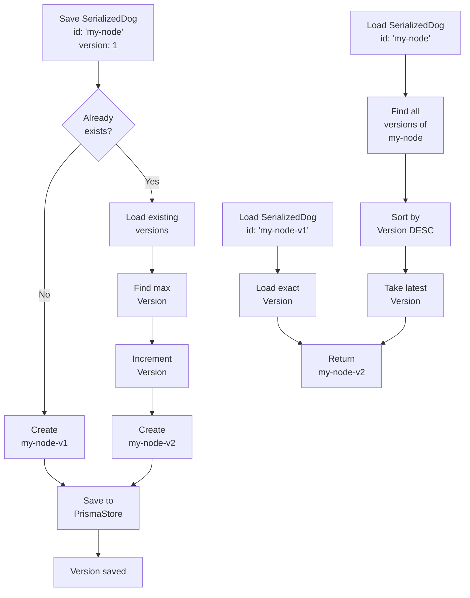

*(**Fass** here is the churn of versions; **Khra** — time — is the line that says: the latest is not the only ghost you can summon.)*

---

> *To cosmic forms from tangent planes*  
> *We end as we began.*  
> — **Khra** · *Time*

## Data Structures — the planes where types lie still

**Khra** closes the loop: the season’s shape is fixed in interfaces — **withBeesInThePants**, **exhausted**, **wave**, **readTracking**. Kennel config holds **dogIds** and defaults; Serialized config holds **theRun** and **parents**. We end as we began: with types that outlive any single run.

### IHuntingSeason

```typescript
interface IHuntingSeason {
    withBeesInThePants: IHuntingDog<unknown>[];  // Dogs that still need to run
    exhausted: IHuntingDog<unknown>[];          // Dogs that are finished
    runIndex: number;                           // Current run index
    maxRuns: number;                            // Maximum number of runs
    wave: Array<IWaveEntry[]>;                 // Array of waves
    readTracking: IReadTrackingEntry[];         // Tracking of property accesses
    currentWaveIndex?: number;                  // Current wave index
}
```

### IKennelConfig

```typescript
interface IKennelConfig {
    id: string;
    name?: string;
    description?: string;
    dogIds: string[];                           // Array of dog IDs
    defaultQuery?: Record<string, string>;      // Default query parameters
    defaultBody?: any;                          // Default body data
    createdAt?: Date;
    updatedAt?: Date;
}
```

### ISerializedDogConfig

```typescript
interface ISerializedDogConfig {
    id: string;
    theRun: string;                             // TypeScript code as string
    version: number;                            // Version number
    parentsRequired?: string[];                 // Required parent IDs
    parentsOptional?: string[];                 // Optional parent IDs
}
```

---

> *Carrion hordes trill their profane*  
> *Accord with eldritch plans.*  
> — **Netra** · *Decay*

## Deployment — where the lodge meets the wild

**Netra** is **decay held at bay**: production is not the dev lodge — it is **carrion** kept outside the walls by ports, env vars, reverse proxies, and migrations. The lodge has walls; the wild has teeth. Same pack; colder air.

> The lodge has walls; production has ports and passwords. Same pack, colder air — you still breed, chain, and unleash, only the ground beneath the kennel door is harder.

### Ports

| Surface | Port | Notes |
|--------|------|--------|
| **Backend** (Express, `main.ts`) | **3000** | API, `/save`, public `/:kennelId`, Swagger — the server that actually runs the dogs. |
| **UI** (dev, `ng serve`) | **4300** | Proxies `/api` and `/save` to the backend via [`ui-app/proxy.conf.json`](ui-app/proxy.conf.json). Open the UI here during development. |

### Environment

Copy [`.env.example`](.env.example) to `.env` and fill in secrets locally (API keys, Hue bridge user, ORS keys, and so on). **Never commit `.env`.** At minimum, set `DATABASE_URL` for Prisma (SQLite file in dev, or Postgres in production). Optional integrations (Hue, OpenRouteService, Overpass, Claude) are documented inline in `.env.example`.

### Database

Before first run or after schema changes: from the repo root, `npm run prisma:sync` runs `prisma generate` and `prisma db push` against `store/prisma/schema.prisma`. For production, prefer migrations (`prisma migrate`) and a managed Postgres instance when you leave the SQLite hunting grounds.

### Static UI

`npm run ui:build` builds the Angular app into `ui-app/dist/`. Deploy that folder behind any static host or CDN. The browser must reach the **same origin** as the API, or you configure CORS and absolute API URLs — the dev proxy does not exist in a static build, so wire your reverse proxy (nginx, Caddy, platform defaults) to forward `/api` and `/save` to the Node backend, or bake the backend URL into the Angular environment for your deployment.

### Topology — dev vs production-shaped

Two sketches: local hunt (proxy carries the scent) and split static + API (the trail crosses origins on purpose).

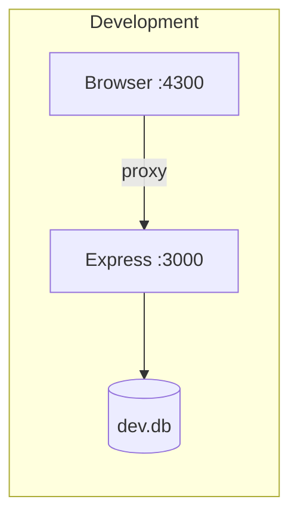

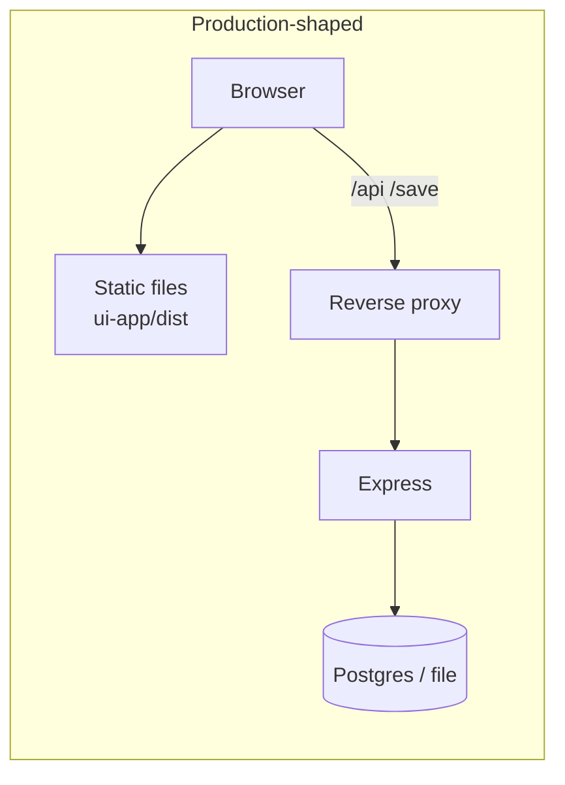

---

## Important Files — grimoire entries

### Core engine
- **[main.ts](main.ts)** — Express gate, dog + pact registration, startup tests  
- **[seed.ts](seed.ts)** — Database seeds (SerializedDogs, MimicDogs, KennelConfigs)  
- **[packages/core/src/KennelRun.ts](packages/core/src/KennelRun.ts)** — fillKennel, autoMimic, orchestration  
- **[packages/core/src/harverster.ts](packages/core/src/harverster.ts)** — SeasonRunner, waves  
- **[packages/core/src/dogs/SerializedDog.ts](packages/core/src/dogs/SerializedDog.ts)** — VM, context, yield  
- **[packages/core/src/dogs/createPact.ts](packages/core/src/dogs/createPact.ts)** — Pact factory  
- **[packages/core/src/dogs/MimicDog.ts](packages/core/src/dogs/MimicDog.ts)** — Shapeshifter dogs  
- **[packages/core/src/core/entities/abstractHuntingDog.ts](packages/core/src/core/entities/abstractHuntingDog.ts)** — Dog base, dependencies, read tracking  
- **[packages/core/src/platform/baseDogIcons.ts](packages/core/src/platform/baseDogIcons.ts)** — Icon registry for all BaseDogs  
- **[store/PrismaStore.ts](store/PrismaStore.ts)** — persistence, versions  

### Dog packages
- **[packages/dogs-demo/](packages/dogs-demo/)** — RandomRecipesRetriever, CountryFlagBlackLab, DishFlagBlackLab, RandomEveryThingRetriever  
- **[packages/dogs-geo/](packages/dogs-geo/)** — BloodhoundRouteRetriever, BloodhoundIsochroneRetriever, OsmLandmarksRetriever  
- **[packages/dogs-public-transport/](packages/dogs-public-transport/)** — PublicTransportRetriever (nearby stops + departures via MOTIS)  
- **[packages/dogs-hue/](packages/dogs-hue/)** — HuePlaygroundRetriever, HueBridgeEnvRetriever  
- **[packages/dogs-talking/](packages/dogs-talking/)** — TalkingDog (HTML rendering)  
- **[packages/dogs-warframe/](packages/dogs-warframe/)** — WarframeAlertsRetriever  

### Adding a new BaseDog package

See [Creating a new BaseDog Package](README.md#creating-a-new-basedog-package) in the README for a step-by-step guide. In short: scaffold a package under `packages/`, extend `Dog<T>`, define a Pact if input is needed, register in `main.ts` + `baseDogIcons.ts`, wire the build in root `package.json` + `tsconfig.json`, run `npm install`, optionally seed a Kennel in `seed.ts`.  

---

*We end as we began — with a name on the door and a pack in the dark.*
